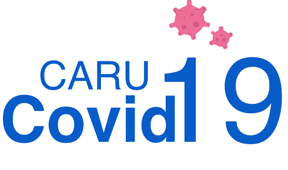

<h1 align="center">
    
</h1>

  <a href="#-technology">Technology</a>&nbsp;&nbsp;&nbsp;|&nbsp;&nbsp;&nbsp;
  <a href="#-project">Project</a>&nbsp;&nbsp;&nbsp;|&nbsp;&nbsp;&nbsp;
  <a href="#-layout">Layout</a>&nbsp;&nbsp;&nbsp;|&nbsp;&nbsp;&nbsp;
  <a href="#-how-to-contribute">How to Contribute</a>&nbsp;&nbsp;&nbsp;|&nbsp;&nbsp;&nbsp;
  <a href="#memo-license">License</a>

  <row>
    
    
    
    
  </row>

 

  

## 🚀 Technology

This project was development with:

- [Flutter](https://flutter.dev/)

## 💻 Project

This project was implemented on a non-profit basis with the purpose of helping people in the city of Carutapera with information about cases, prevention, tests and symptoms of Covid-19.

## 🔖 Layout

The user interface created for this application was developed by the author of this repository. It was done with Adobe XD based on some inspirations found on the internet. Some illustrations were created and others were searching from the internet where they could be free to use. More details of the UI are in the [Prototype](https://github.com/michaelmartins09/caru_covid_flutter/tree/master/prototype) directory.

## 🤔 How to contribute?

- Fork this repository;
- Create a branch with your feature: `git checkout -b feature/your_feature_name`;
- Commit your changes: `git commit -m 'feat: My new feature'`;
- Push your commit to your branch: `git push origin feature/your_feature_name`.

After the merge of your pull request is done, you can delete your branch.

## :memo: License

This project is under the MIT license. See the [LICENSE](LICENSE.md) for more details.

---

Create with ♥ by Michael Martins
